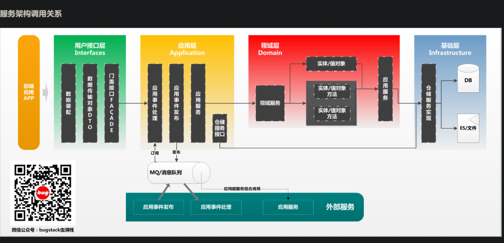
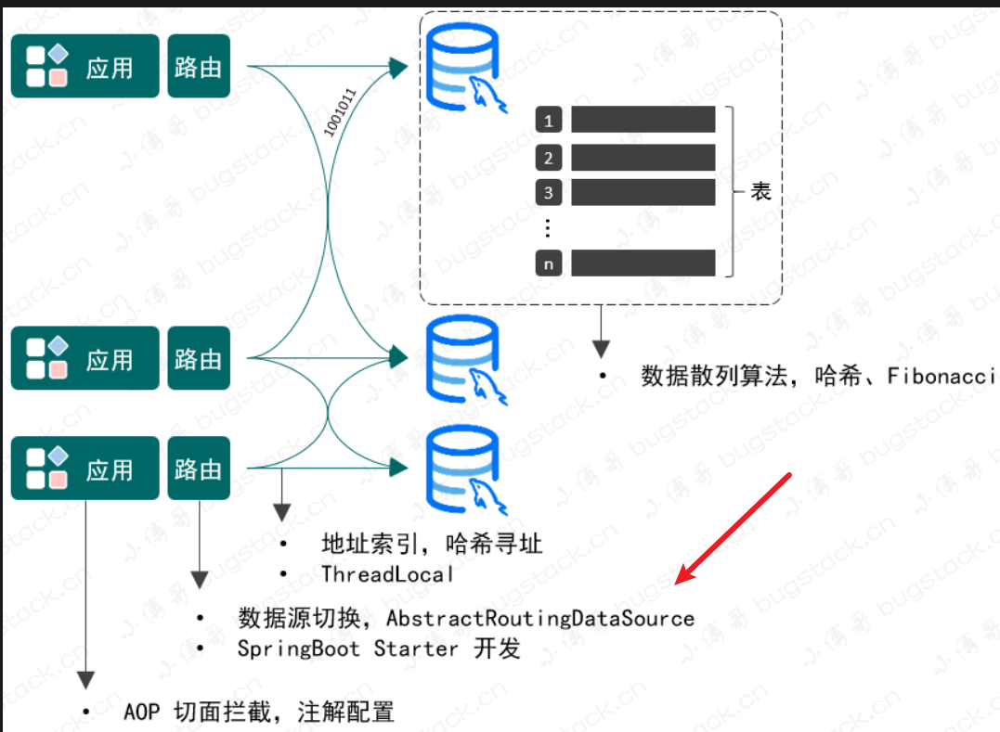
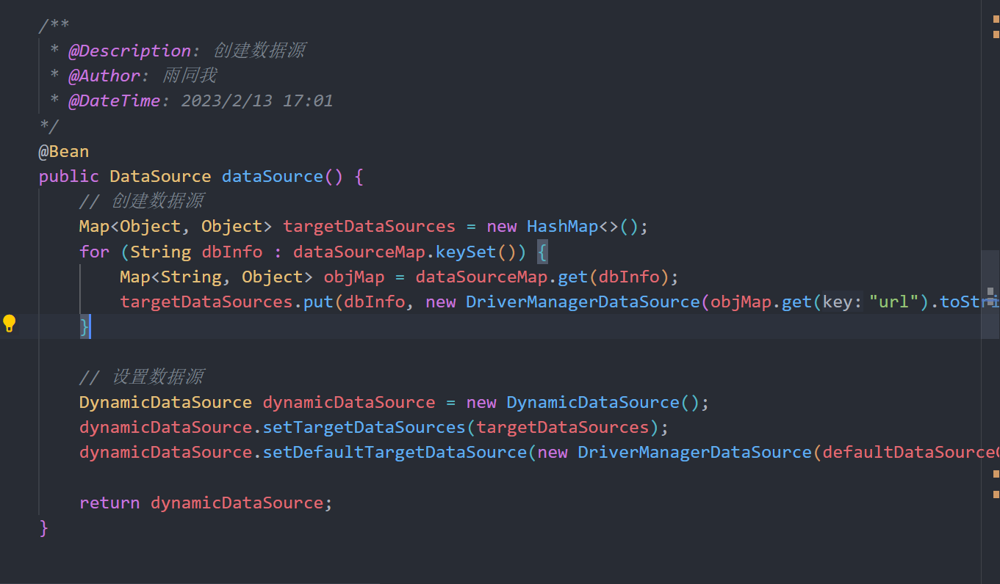

## dubbo注意点
- 版本问题

```xml
<dependency>
    <groupId>org.apache.dubbo</groupId>
    <artifactId>dubbo</artifactId>
    <version>2.7.10</version>
</dependency>
<dependency>
<groupId>org.apache.dubbo</groupId>
<artifactId>dubbo-spring-boot-starter</artifactId>
<version>2.7.10</version>
</dependency>
<dependency>
<groupId>com.alibaba.boot</groupId>
<artifactId>nacos-discovery-spring-boot-starter</artifactId>
<version>0.2.7</version>
</dependency>

```

- 所有版本参考
[版本参考](https://github.com/alibaba/spring-cloud-alibaba/wiki/%E7%89%88%E6%9C%AC%E8%AF%B4%E6%98%8E)




```java
主要看测试类 lottery-test 里面的今天实现
里面的 lottery-interfaces 是服务端，
它里面有时mapper扫描不到记得添加MapperScan即可。
```


hashcode计算下标，使用下面的算法，初始数组长度128才能没有碰撞

```java
public class Main {
    private final static int HASH_INCREMENT = 0x61c88647;
    private final static int RATE_TUPLE_LENGTH = 128;

    public static void main(String[] args) {
        int[] a = {1, 2, 3, 9, 20};
//        int code=(int)(Math.pow(2,32)*0.6180339887);
        int code = 0x61c88647;
        HashSet<Integer> set = new HashSet<>();
        for (int i = 0; i < 3; i++) {
            int t = new SecureRandom().nextInt(100) + 1;
            int idx = hashIdx(i);
            System.out.println(i + " " + idx);
            if (set.contains(idx)) {
                break;
            }
            set.add(idx);
        }
        System.out.println(set.size());
        System.out.println(set);
    }

    protected static int hashIdx(int val) {
        int hashCode = val * HASH_INCREMENT + HASH_INCREMENT;
        return hashCode & (RATE_TUPLE_LENGTH - 1);
    }
}
```

大整数的方法参数详解
[divide](https://blog.csdn.net/w_monster/article/details/112008308)


### Strategy注解的使用


- 自定义注解的作用


- 作用

```
获取里面的 code (1,2,.....)
@Strategy(strategyMode = Constants.StrategyMode.ENTIRETY)
```


```
       algorithmList.forEach(algorithm -> {
            Strategy strategy = AnnotationUtils.findAnnotation(algorithm.getClass(), Strategy.class);
            if (null != strategy) {
                drawAlgorithmGroup.put(strategy.strategyMode().getCode(), algorithm);
            }
        });
```


### 模板模式一套流程，如何确定启用那个模型（1单2全）


具体实现：


### 雪花算法实现id

[唯一ID工具-IdUtil (hutool.cn)](https://hutool.cn/docs/#/core/工具类/唯一ID工具-IdUtil?id=使用)


```
使用hutool工具
snowflake = IdUtil.createSnowflake(workerId, dataCenterId);
//参数1为终端ID
//参数2为数据中心ID
```


```
import cn.hutool.core.lang.Snowflake;
import cn.hutool.core.net.NetUtil;
import cn.hutool.core.util.IdUtil;
import cn.itedus.lottery.domain.support.ids.IIdGenerator;
import org.springframework.stereotype.Component;

import javax.annotation.PostConstruct;

@Component
public class SnowFlake implements IIdGenerator {

    private Snowflake snowflake;

    @PostConstruct
    public void init() {
        // 0 ~ 31 位，可以采用配置的方式使用
        long workerId;
        try {
            workerId = NetUtil.ipv4ToLong(NetUtil.getLocalhostStr());
        } catch (Exception e) {
            workerId = NetUtil.getLocalhostStr().hashCode();
        }

        workerId = workerId >> 16 & 31;

        long dataCenterId = 1L;
        snowflake = IdUtil.createSnowflake(workerId, dataCenterId);
    }

    @Override
    public synchronized long nextId() {
        return snowflake.nextId();
    }

}

```


### 分库分表


#### 分库分表传表名

[参考代码](https://gitee.com/rain-me/springboot-start/tree/master/1-%20mybatis-test)


### spring.factories用法


```apl
将不在启动类包下的类注入到IOC容器中
也可以使用@import
```


[Spring Boot 之 spring.factories的用法](https://blog.csdn.net/qq_32448349/article/details/109155988)


### Mybatis 拦截器

基本使用：

[自定义实现拦截器插件Interceptor](https://cloud.tencent.com/developer/article/1734409)


深入了解：

[深入理解Mybatis插件开发 - 风一样的码农 - 博客园](https://www.cnblogs.com/chenpi/p/10498921.html)


#### 基本使用


:cactus: mybatis插件

```java
import com.lu.edu.utils.ReflectUtil;
import org.apache.ibatis.executor.statement.StatementHandler;
import org.apache.ibatis.mapping.BoundSql;
import org.apache.ibatis.plugin.*;

import java.sql.Connection;
import java.util.Date;
import java.util.Properties;

/**
 * @Description: mybatis拦截器
 * @Author: 雨同我
 * @DateTime: 2023/2/14 19:54
*/
@Intercepts(value = {@Signature(type = StatementHandler.class, method = "prepare", args = {Connection.class, Integer.class})})
public class MyInterceptor implements Interceptor {

    @Override
    public Object intercept(Invocation invocation) throws Throwable {
        StatementHandler statementHandler = (StatementHandler) invocation.getTarget();
        BoundSql boundSql = statementHandler.getBoundSql();
        Object obj = boundSql.getParameterObject();
        String sql = boundSql.getSql();
        if (sql.trim().toUpperCase().startsWith("SELECT")) {
//            ReflectUtil.setFieldValue(obj, "rev", 0);
            ReflectUtil.setFieldValue(obj, "gmt_create", new Date());
            ReflectUtil.setFieldValue(obj, "gmt_modified", new Date());
//            ReflectUtil.setFieldValue(boundSql,"parameterObject", obj);

        } else if (sql.trim().toUpperCase().startsWith("UPDATE")) {
            sql = sql.replaceAll(" set ", " SET ")
                    .replaceAll(" Set ", " SET ")
                    .replaceAll(" SET ", " SET rev = rev+1, operate_time = NOW(), ");
            ReflectUtil.setFieldValue(boundSql,"sql", sql);
        }
        return invocation.proceed();
    }

    @Override
    public Object plugin(Object o) {
        return Plugin.wrap(o, this);
    }

    @Override
    public void setProperties(Properties properties) {

    }
}
```

上面涉及的工具类

```java
public class ReflectUtil {

    private ReflectUtil() {}

    /**
     * 利用反射获取指定对象的指定属性
     * @param obj 目标对象
     * @param fieldName 目标属性
     * @return 目标字段
     */
    private static Field getField(Object obj, String fieldName) {
        Field field = null;
        for (Class<?> clazz = obj.getClass(); clazz != Object.class; clazz = clazz.getSuperclass()) {
            try {
                field = clazz.getDeclaredField(fieldName);
                break;
            } catch (NoSuchFieldException e) {
                //这里不用做处理，子类没有该字段，可能父类有，都没有就返回null
            }
        }
        return field;
    }

    /**
     * 利用反射设置指定对象的指定属性为指定的值
     * @param obj 目标对象
     * @param fieldName 目标属性
     * @param fieldValue 目标值
     */
    public static void setFieldValue(Object obj, String fieldName, Object fieldValue) throws IllegalAccessException {
        Field field = getField(obj, fieldName);
        if (field != null) {
            field.setAccessible(true);
            field.set(obj, fieldValue);
            field.setAccessible(false);
        }
    }
}
```


:cactus:注入到 IOC 容器的 2 种方式


### 数据源的切换


```apl
思路：
可以重写里面的数据源，例如springboot里面内置的HikariDataSource
```

重写的方式参考： [重写数据源切换](https://github.com/xkcoding/spring-boot-demo/tree/master/demo-dynamic-datasource)





```apl
核心在这个AbstractRoutingDataSource类里面，里面重写一个方法，然后确定使用的数据源，切换的话，使用aop去动态计算然后把他存放到TreadLocal
 - 缺点：无法动态的增加数据源

public class DynamicDataSource extends AbstractRoutingDataSource {
    @Override
    protected Object determineCurrentLookupKey() {
        return "db" + DBContextHolder.getDBKey();
    }
}

```

AbstractRoutingDataSource 的解析参考： [spring boot使用AbstractRoutingDataSource实现](https://blog.csdn.net/qq_37502106/article/details/91044952)


- 先把数据源加载进去，然后后面通过key取出来，通过AbstractRoutingDataSource的getConnection() 




```
多个数据库表进行操作，开启事务
```

