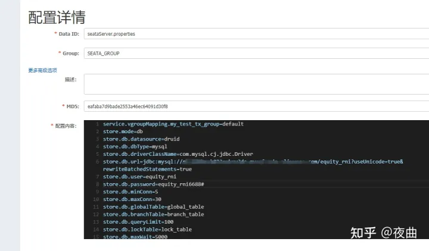

# 注意点

<br/>

## 这里版本

```java
seata 1.4.2 (启动直接bin目录下面bat文件启动)

```

## 数据库代理
- enable-auto-data-source-proxy这个配置默认开启（默认开启，配置相关配置就可以使用seata了），切换其他的可以自己配置。

<br/><br/>

## 版本问题

<br/>

[官网参考](https://github.com/alibaba/spring-cloud-alibaba/wiki/%E7%89%88%E6%9C%AC%E8%AF%B4%E6%98%8E)


<br/><br/>

# 具体教程

<br/><br/>


## **1.背景介绍**

Seata 是一款开源的分布式事务解决方案，致力于提供高性能和简单易用的分布式事务服务。Seata 将为用户提供了 AT、TCC、SAGA 和 XA 事务模式，为用户打造一站式的分布式解决方案，本文将介绍快速整合seata+nacos+mysql模式

<br/>


<br/>


官方地址:[https://seata.io/zh-cn/docs/overview/what-is-seata.html](https://link.zhihu.com/?target=https%3A//seata.io/zh-cn/docs/overview/what-is-seata.html)

<br/><br/>


## **2.搭建Server端**

下载服务端：[https://github.com/seata/seata/releases](https://link.zhihu.com/?target=https%3A//github.com/seata/seata/releases)

<br/>


<br/><br/>

### **2.1搭建seata数据库**

- 查看sql文件

<br/><br/>

### **2.2 服务端配置上传nacos**

connfig-center：[https://github.com/seata/seata/tree/1.4.2/script/config-center](https://link.zhihu.com/?target=https%3A//github.com/seata/seata/tree/1.4.2/script/config-center)

修改后congfig.txt

```properties
service.vgroupMapping.seata-ok-group=default
store.mode=db
store.db.datasource=druid
store.db.dbType=mysql
store.db.driverClassName=com.mysql.cj.jdbc.Driver
store.db.url=jdbc:mysql://127.0.0.1:3306/seata?useUnicode=true&rewriteBatchedStatements=true
store.db.user=username
store.db.password=password
store.db.minConn=5
store.db.maxConn=30
store.db.globalTable=global_table
store.db.branchTable=branch_table
store.db.queryLimit=100
store.db.lockTable=lock_table
store.db.maxWait=5000
```

新增seataServer.properties 配置

<br/><br/>



<br/><br/>


### **2.3 registry.conf**

修改服务registry.conf 配置文件，注意group,cluster,dataId参数配置~

<br/><br/>


<br/><br/>

```java
registry {
  # file 、nacos 、eureka、redis、zk、consul、etcd3、sofa
  type = "nacos"
  nacos {
    application = "seata-server"
    serverAddr = "127.0.0.1:8848"
    group = "SEATA_GROUP"
    namespace = ""
    cluster = "default"
    username = "nacos"
    password = "nacos"
  }
}
config {
  # file、nacos 、apollo、zk、consul、etcd3
  type = "nacos"
  nacos {
    serverAddr = "127.0.0.1:8848"
    namespace = ""
    group = "SEATA_GROUP"
    username = "nacos"
    password = "nacos"
    dataId = "seataServer.properties"
  }
}

```

<br/><br/>


### **2.4 启动**

<br/>


<br/><br/>

## **3.Clien端整合**

<br/><br/>

### **3.1 新增undo_log表**

参与全局事务的服务数据库中加入undo_log这张表

```mysql
-- for AT mode you must to init this sql for you business database. the seata server not need it.
CREATE TABLE IF NOT EXISTS `undo_log`
(
    `branch_id`     BIGINT       NOT NULL COMMENT 'branch transaction id',
    `xid`           VARCHAR(128) NOT NULL COMMENT 'global transaction id',
    `context`       VARCHAR(128) NOT NULL COMMENT 'undo_log context,such as serialization',
    `rollback_info` LONGBLOB     NOT NULL COMMENT 'rollback info',
    `log_status`    INT(11)      NOT NULL COMMENT '0:normal status,1:defense status',
    `log_created`   DATETIME(6)  NOT NULL COMMENT 'create datetime',
    `log_modified`  DATETIME(6)  NOT NULL COMMENT 'modify datetime',
    UNIQUE KEY `ux_undo_log` (`xid`, `branch_id`)
) ENGINE = InnoDB
  AUTO_INCREMENT = 1
  DEFAULT CHARSET = utf8 COMMENT ='AT transaction mode undo table';
```

<br/><br/>

### **3.2 pom**

对应服务的pom文件引入seata依赖

```xml
<dependency>
     <groupId>io.seata</groupId>
     <artifactId>seata-spring-boot-starter</artifactId>
     <version>1.4.2</version>
</dependency>
<dependency>
       <groupId>com.alibaba.cloud</groupId>
       <artifactId>spring-cloud-starter-alibaba-seata</artifactId>
       <version>2.2.1.RELEASE</version>
       <exclusions>
            <exclusion>
               <groupId>io.seata</groupId>
                <artifactId>seata-spring-boot-starter</artifactId>
            </exclusion>
        </exclusions>
</dependency>
```

<br/><br/>


### **3.3 yml**

官方参考：[https://github.com/seata/seata/blob/1.4.2/script/client/spring/application.yml](https://link.zhihu.com/?target=https%3A//github.com/seata/seata/blob/1.4.2/script/client/spring/application.yml)  直接去掉一些不相关的即可

<font color='red'>   注意修改 application-id  和 tx-service-group </font>


<br/>

```text
seata:
  enabled: true
  application-id: applicationName
  tx-service-group: seata-ok-group
  enable-auto-data-source-proxy: true
  data-source-proxy-mode: AT
  config:
    type: nacos
    nacos:
      namespace: ""
      server-addr: 127.0.0.1:8848
      group: SEATA_GROUP
      username: "nacos"
      password: "nacos"
  registry:
    type: nacos
    nacos:
      application: seata-server
      server-addr: 127.0.0.1:8848
      group : "SEATA_GROUP"
      namespace: ""
      username: "nacos"
      password: "nacos"
```